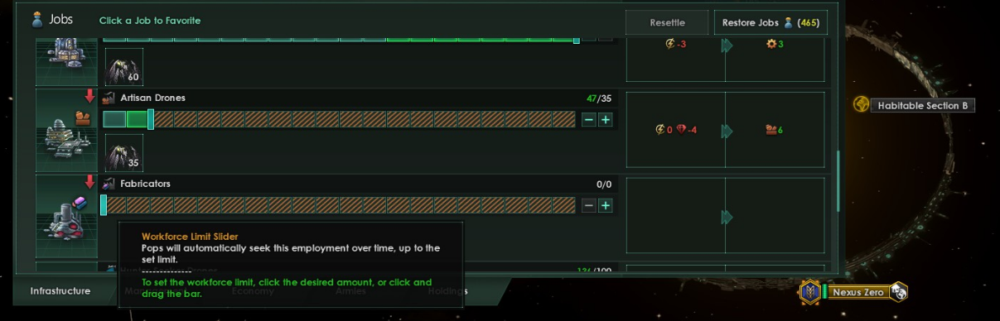

# Guide: Shattered Ring Rogue Servitors (Virtual Ascension)

## Build Overview

| Category | Selection | Notes |
| -------- | -------- | -------- |
| Species    |  Machine   | Unlocks Machine Intelligence   |
| Ethics    |  Gestalt Consciousness   | Unlocks Machine Intelligence   |
| Authority    |  Machine Intelligence   | Unlocks Rogue Servitor   |
| Civics    |  Rogue Servitor   | Increases Complex Drone efficiency, boosting our Empire's Research and Alloys   |
|     |  Memorialist   | Creates Chronicle Drone jobs from Capital buildings, allowing an additional source of Unity for the early game    |
| Origin    |  Shattered Ring   | Ring Worlds scale very well with Virtual Ascension, especially with Research District Specializations   |
| Machine Species Traits    |  Research Assistants | We will be focusing most of our early game economy on Research to develop and repair our starting Ring World |
|     |  Adaptive Frames | Flexible Trait that allows us to boost both Technician and Research jobs  |
|     |  Mass-Produced | Faster Pop growth for the early game; obsolete after Virtual Ascension  |
|     |  High-Bandwidth | Extra Trait points for the early game; we will remove this trait in the late game to minimize Empire Size  |
|     |  Bulky | Extra Trait points; housing is almost never an issue for Virtual Empires |
| Bio-Trophy Species    |  Any Plantoid or Fungoid | Unlocks Budding |
| Bio-Trophy Species Traits    |  Budding | Extra Bio-Trophy growth, especially for more passive empires |
|  |  Charismatic | Boosts Bio-Trophy efficiency |
|  |  Unbreakable Resolve | Extra colony stability which increases job output |
|  |  Decadent | Flavorful and does not affect Bio-Trophies |
|  |  Rooted | Controlled settlement of our Bio-Trophies to avoid them migrating to low-habitability ring sections too soon |

### Build Summary
The main focus of this build is to maximize research to rush a Cosmogenesis victory (in a competitive setting) or to stack repeatable technologies for higher fleet power against Crises (in a cooperative setting). It is worth noting that Research Job Efficiency, Research Job Output, Research Speed, and low Empire Size are integral to increasing an empire's overall research output. While Machine Intelligences struggle to gain as much Research Speed as an Individualistic Empire, they do have access to Bio-Trophies that greatly boost the efficiencies of all their Complex Drones. These Bio-Trophies are then stacked with the strengths of Virtuality, namely low Empire Size and extra Research output from the Virtual Research Focus Policy.

### Build Strengths
- High Research Output
- Extremely High Complex Drone Job Efficiency
- Low Empire Size
- High mid-game power spike

### Build Weaknesses
- Low Unity Output
- Moderate Research Speed
- Moderate late-game potential

## Progression

### Turn Zero Setup
| Icon | Name | Hotkey | Notes | 
| -------- | -------- | -------- | -------- |
|  | Council    | F2   | Change Agenda to Finding the Voice |
|  | Policies & Edicts    | F2 → C   | Change Diplomatic Stance to Isolationist for extra Unity |
|  | Capital | 1 → C | Limit Artisan Drones  and Fabricators  to near 0; they are consuming too many minerals that we need for early development |

### Expansion

We will queue two Scientist Ships for Survey of neighboring star systems. We want to add around 20 star systems to our empire as we need this room for Megastructures in the late game. While we only need relatively few systems, we prioritize claiming them before we clash borders with other empires
  
### Capital Economy

Build a Civilian Industries and Alloy Foundries in your generic building slots (disable and enable them as needed). We will be changing the Mixed Industry district specialization of our Capital to Research Enclave when able. Maintain a healthy amount of energy jobs as we will need a lot of energy to improve our other two Ring Segments.

### Other Colonies

Settle the other two Ring Segments as soon as possible; do not move Bio-Trophies there yet. We need to research some technologies and clear blockers to improve the habitability for our bio pops. Be sure to build Machine Assembly Plants on these colonies too.

### Key Physics Research 

| Icon | Name | Tier | Notes | 
| -------- | -------- | -------- | -------- |
|  | Quantum Computing | 1 | Unlocks building to boost Physics Subroutine Drones |
|  | Academic Optimization | 1 | Unlocks Alpha Hub (see Key Society Research) | 
|  | Field Modulation | 1 | Unlocks Global Energy Management |
|  | Global Energy Management | 1 | Unlocks Building and Edict to greatly buff our Energy job output; allows us to clear blocker on damaged Ring Segments |
|  | Improved Deflectors | 1 | Allows us to clear blocker on damaged Ring Segments |
|  | Dyson Swarm | 2 | Our Capital Star makes for an excellent target of a Dyson Swarm |

### Key Society Research 

| Icon | Name | Tier | Notes | 
| -------- | -------- | -------- | -------- |
|  | Xenobiology | 1 | Unlocks building to boost Society Subroutine Drones |
|  | Societal Unification | 1 | Unlocks Colonial Centralization |
|  | Colonial Centralization | 2 | Unlocks Tier 3 capital buildings for extra Chronical Drones |
|  | Alpha Hub | 3 | Boost Unity from Bio-Trophies |

### Key Engineering 

| Icon | Name | Tier | Notes | 
| -------- | -------- | -------- | -------- |
|  | Nanomechanics | 1 | Unlocks building to boost Engineering Subroutine Drones |
|  | Rare Crystal Manufacturing | 2 | Allows us to start producing and trading Rare Crystals for Alpha Hub building |
|  | Arc Furnace | 2 | Extra Source of Alloys and Minerals |
|  | Ion Thrusters | 2 | Allows us to clear blocker on damaged Ring Segments |
|  | Starhold | 2 | Allows us to clear blocker on damaged Ring Segments |

### Tradition Progression

First Adopt  Prosperity:

| Icon | Name | Notes | 
| -------- | -------- | -------- |
|  | Prosperity | Unlocks Favored Society Agenda ; Switch to this Agenda immediately and then back to Finding the Voice after its launched |
|  | Standard Construction Templates | Quicker and cheaper construction |

Do not finish Prosperity yet; now adopt and finish  Statecraft. Finish Prosperity after finishing Statecraft. We may then pick and finish whichever Tradition Tree of our choosing. For example,  Discovery can help with our early game research and expansion. Do not start a fourth Tradition Tree until we finish our Virtuality Synthetic Age Ascension and Situation; we will stockpile Unity for this.

### Ascension Perk Progression

 Technological Ascendancy or  Transcendent Learning would be a good first pick. Then  Enigmatic Engineering as a second. Finally, take 
 Synthetic Age as your third. Synthetic Age will start a simple situation; we will overclock the Situation in the Situation tab and choose to devote all resources whenever prompted to get the best outcome. Near the end of the situation, we will be prompted to choose between Virtuality, Nanotech, and Modularity. We choose Virtuality.

###  Mega-Engineering Rush

We will experience a large boost to our economy and research after finishing Virtuality as all available drone jobs will automatically be filled. We now push for Mega-Engineering to start fully repairing our Ring Segments. To do this, we first focus on the prerequisites of the Mega-Engineering technology (Zero Point Power, Citadel, and Battleships). That is, we first research the Power chain of Physics Research:

| Icon | Name |
| -------- | -------- |
|  | Fusion Power |
|  | Cold Fusion Power | 
|  | Antimatter Power |
|  | Zero Point Power |

We then fully specialize to Engineering Research and research Ship and Starbase Technologies:

| Icon | Name |
| -------- | -------- |
|  | Starhold |
|  | Star Fortress |
|  | Citadel |
|  | Destroyers |
|  | Cruisers |
|  | Battleships |

Then, we continue engineering research until we draw Mega-Engineering as an option. If we were able to maintain a healthy Alloy production, we will be able to repair our Ringworld Segments almost as soon as we finish researching Mega-Engineering.

### Onward

The build is pretty flexible from here, so try different combinations of Traditions and Colony setups. Virtuality tends to benefit from a low colony count (about 8), so extra colonies and expansion can be vassalized as Scholariums for extra research without penalties to Empire Size or Virtual Job Efficiency.

